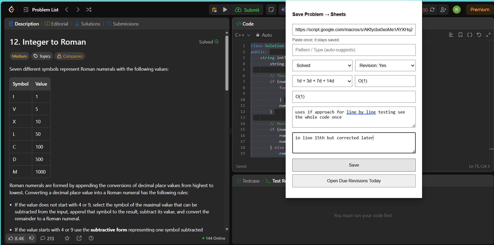

🚀 Code Replay

Track. Solve. Revise. Repeat.

Code Replay is a powerful browser extension that helps competitive programmers and interview aspirants track coding problems directly into their own Google Sheets — with structured notes, intelligent revision tracking, and multi-platform support.

     

🌍 Supported Platforms

Code Replay now supports:

✅ LeetCode

✅ Codeforces

✅ GeeksforGeeks

✅ CodeChef

✅ HackerRank

✅ CSES

✅ InterviewBit

✅ AtCoder

✨ What’s New (Latest Update 2.1.0)
🔥 Improvements & Fixes

✅ Fixed LeetCode difficulty detection (now correctly detects Easy / Medium / Hard)

✅ Added support for 8 major coding platforms

✅ Improved CodeChef title detection

✅ Improved tag filtering logic

✅ Enhanced UI design & layout (modern dark premium feel)

✅ Better error handling

✅ More reliable revision scheduling

✅ Improved content script detection

🟢 Extension Status Indicator

At the top of the popup you will see:

🟢 Ready • Detected: PlatformName

✔ If you see “Detected”

The extension is correctly attached to the problem page.

❌ If you do NOT see it

👉 Refresh the page once.

🔄 Important: When Switching Platforms

If you move from one platform to another:

LeetCode → Codeforces

Codeforces → AtCoder

AtCoder → CSES

etc.

👉 You must refresh the page once before saving.

This ensures the extension re-attaches correctly.

⚠ Important Usage Rules (Codeforces, CSES, AtCoder)

You must save problems only from the actual problem/task page.

🔵 Codeforces

Save only from:

/problemset/problem/...

or

/contest/.../problem/...

❌ Do NOT save from:

Submit page

Standings page

Contest overview

Results page

🟢 CSES

Save only from:

/problemset/task/...

🟡 AtCoder

Save only from:

/contests/.../tasks/...

If you try saving from unsupported pages, you may see:

Open supported problem URL

This is expected behavior.

🔥 Features

✅ Automatic problem detection

📌 Save problem title + direct link

📊 Difficulty tracking (Auto-detected)

🏷 Pattern & tag organization

📝 Personal approach & mistake notes

⏱ Time & space complexity logging

🔁 Spaced revision reminders (1d / 3d / 7d / 14d)

🚀 One-click “Open Due Revisions”

💎 Modern premium UI

🖼 Screenshots
🔹 Extension Popup

   
 
   

📊 Google Sheet Output

  

⚙️ Complete Setup Guide

Setup takes 3–5 minutes.

Step 1 – Create Google Sheet

Go to https://sheets.google.com

Click Blank

Rename it: Code Replay Tracker

Create a sheet tab named exactly:

Questions

⚠ The tab name must be exactly Questions

Step 2 – Get Your Sheet ID

Your sheet URL looks like:

https://docs.google.com/spreadsheets/d/YOUR_SHEET_ID/edit#gid=0

Copy the long string between:

/d/   and   /edit

That is your SHEET_ID

🚨 IMPORTANT: Google Apps Script Must Be Updated

If you updated to the latest extension version:

👉 You must re-copy the Google Apps Script file.

Even if your old version was working.

This prevents:

❌ Failed to fetch errors

❌ CORS errors

❌ Revision scheduling issues

❌ Difficulty not saving

❌ Column mismatch issues

Step 3 – Add Google Apps Script

Inside your Google Sheet:

Extensions → Apps Script

Delete all existing code in Code.gs

Open this file from repository:

apps-script/Code.gs

Copy full code

Paste into Apps Script

Step 4 – Paste Your Sheet ID

Find this line:

const SHEET_ID = "PASTE_YOUR_SHEET_ID_HERE";

Replace with:

const SHEET_ID = "your_real_sheet_id_here";

Click Save

Step 5 – Deploy as Web App

Click:

Deploy → New deployment

Choose:

Type: Web App

Execute as: Me

Who has access: Anyone

Click Deploy
Authorize permissions

Copy the Web App URL (must end with /exec)

Example:

https://script.google.com/macros/s/XXXXXXX/exec

⚠ Do NOT copy the /dev link.

Step 6 – Connect the Extension

Open Code Replay popup

Paste /exec URL

Click Save

Open a supported problem page

Click Save

🎉 Your problem will now appear in Google Sheets.

🔐 Privacy

✅ No personal data collection

✅ No external database

✅ All data stored in YOUR Google Sheet

✅ Fully open source

🛠 Tech Stack

Manifest V3 Extension

Content Scripts

Background Service Worker

Google Apps Script (Web App)

Google Sheets API

📁 Project Structure
extension/
  manifest.json
  popup.html
  popup.js
  background.js
  content.js
  icon.png

apps-script/
  Code.gs

🚀 Future Improvements

Dashboard analytics

Smart tag enhancement

Platform difficulty normalization

Performance statistics

Mobile-friendly sheet template

🤝 Contributing

Contributions are welcome!

Please read:

👉 View Contribution Guide

⭐ Support

If this project helps you:

⭐ Star the repository
📢 Share with your friends
🚀 Build consistency
